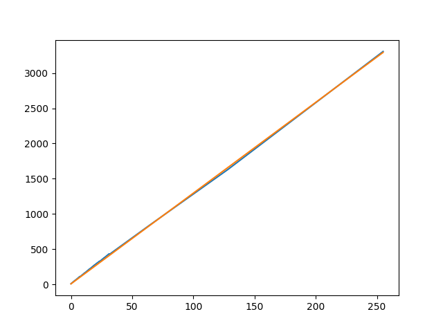
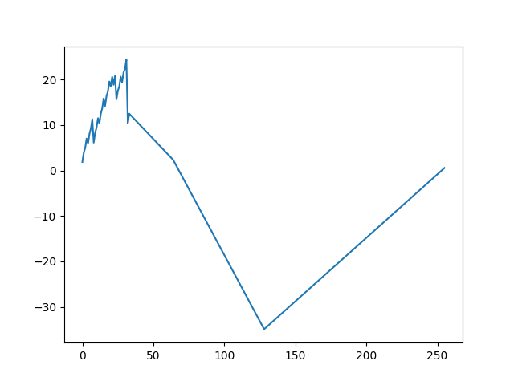
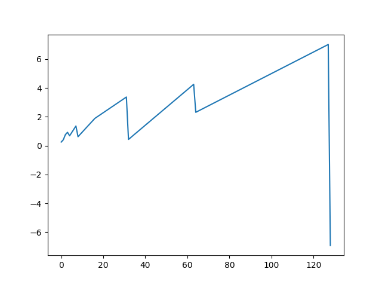
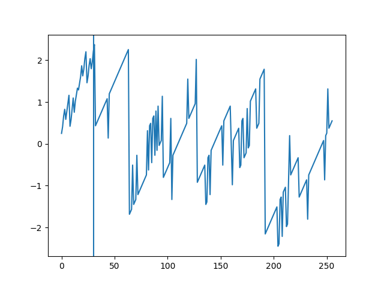
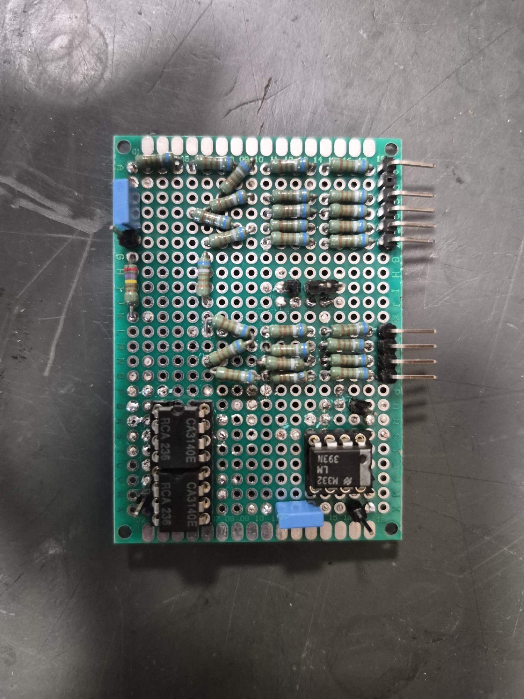
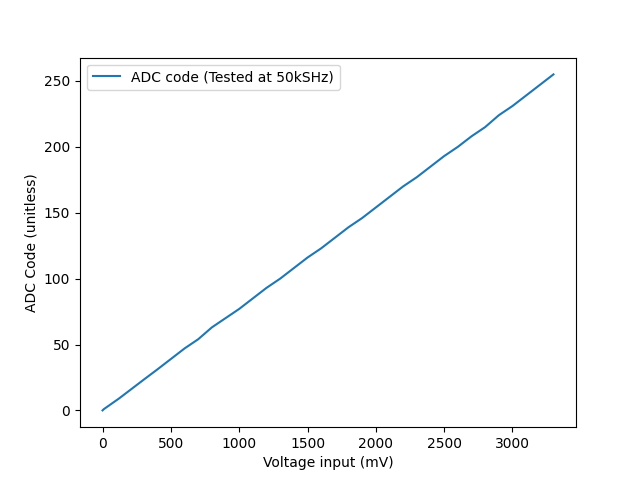

# ADC Design and calculations

In order to digitize the thermister voltage, we built an 8 bit SAR ADC.

Available comparators

| Comparator                     |  LM393N   |  LM311N[1] |
|:-------------------------------|:---------:|-----------:|
| Response Time (5 mV overDrive) | 1.3$\mu$s |     200 ns |

The comparator used was a LM393N. 
While the LM311N is much faster, it is also a dual supply input comparator.
Without an easy -12V supply, we would need to complicate the design even further, which is not worth the increased sampling rate due to the slow response of the system.

We decided on 8 bits due to the sensitivity of the comparator and the FPGA pinout.
The FPGA has 8 data pins per 2 pmods on the same level. Going above 8 bits would make the PCB more complicated.
Additionally, at 8 bits, the quantisation level is $ \frac{3.3V}{2^8}$ = 13 mV (+-6.35 mV to the nearest quantisation step) (3.3V since only the supply voltage is 12V, the logic is all on 3.3V). 
Adding more bits would only add even more noise, as most ICs only give information for 5mV overdrives in the worst case scenario.
Choosing 8 bits is a good compromise between precision, ease of use and noise.

## PCB Layout
We kept the analogue (DAC) part of the system on one side of the perfboard, and the digital comparisons on the other. 
Additionally, we tried to run individual ground and power wires to each section of the board from a central position, which connected to the ground supplied by the FPGA, to limit high frequency noise spreading.
Additionally, we added decoupling capacitors to all power supply pins to improve power stability.

## Sampling Rate
That is due to an assumed parasitic capacitance of 10 pF (approximated from [5]), and a slew rate of $9 \frac{V}{\mu s}$ [4]. 
The SAR algorithm at most jumps by 1.65 V at a time. 
Since the DAC has a resistance of $6.8 k\Omega$, and we need $\Delta V \exp\left(- \frac{T}{RC}\right) = 13 mV \Rightarrow 1.65\text{V} \exp\left(- \frac{T}{6.8k\Omega * 10 pF}\right)=13 mV \Rightarrow T = 0.33\mu s$ for the DAC to stabilize. 
Additionally, the voltage follower needs $\frac{1.65 V}{9 \frac{V}{\mu s}} = 0.18\mu s$.
Combining that with a $1.3\mu\text{s}$ comparator delay and 8 comparisons per sample, we get a max frequency of $\frac{1}{8 * (1.3 \mu s + 0.33\mu s + 0.18\mu s)} = 69 kHz$. 
Hence, we ran the ADC at 50 kHz to give a bit more margin. 
Testing later revealed that this worked quite well.

## Temperature Accuracy and Resolutions
At 13mV quantisation levels, that gives us a 0.4 degrees of resolution. 
Since it is rounding, the error is +-0.2 degrees Celsius. 
Testing later revealed near 0 DC offset with very high accuracy, with only 2.5mV of error. It only sometimes jumps between values (presumably when the measurement voltage is near the quantisation steps).
That gives a final error of 0.48 degrees Celsius.

# ADC Building Process

## Perf board iterations

### Iteration 1:
We began with standard 1 kOhm resistors. 
Halfway through soldering, we realized that the tolerances (+/- 5%) would destroy the tolerances, and decided to redo the board.

### Iteration 2:
We switched to 820 Ohm resistors with +/- 1% tolerances.
We also introduced a 9th bit to the DAC which we permanently toggled on. 
This would bias the DAC voltage by 0.5 bits, which would allow us to convert the ADC into a rounding ADC, halving the absolute error from \[0, 1 bit], to \[-0.5 bit, 0.5 bit].
That does however introduce a 257th range (fencepost theorem). We solved that by making 254 map to 2954, which would give 2 0.5LSB ranges on the edges, and 1.01 LSB ranges in the middle.
We fixed the slightly different distribution with a lookup table on the FPGA after. 
If we later decide to use this ADC for another project without a lookup table, the rounded ADC values would be exactly 0LSB, 1LSB, 2LSB, etc, which can save a calculation on the FPGA need be.

This worked, but we noticed some non-linearity and a large dc offset.

As you can see, it looks quite linear, but as you can see below:

The error can be quite large and jumps around from being too high and too low.
We stopped measuring after we noticed how bad the DAC was performing. 
After some trouble shooting, we learned that the FPGA wasn't outputting 3.3v for HIGH signals, but in between 3.1 and 3.3.
That was because we misunderstood the datasheet. The datasheet says that the FGPA can handle 16 mA per pin, but it means that it can hold a HIGH signal for up to 16 mA, or above 1.65V. 
That is not good enough for our purposes, so we went back to the drawing board.

## Iteration 3
We replaced the resistors with 6.8 kOhm resistors, because when measuring, each pin now output 3.29V or 3.3V.
That did come at the cost of increased propogation time in the DAC, which is an unfortunate but neccesary trade off at this point.
That gave us the following graph:

## Iteration 4
The main issue was the 8th bit delivering too little voltage, and the 16 / 64 bit delivering too much. 
Hence we reduced the resistance on the 8th bit 2R resistors and increased on the 5th/7th bit 2R resistors, which gave us the following errors:

This shows that the DAC is always within 2.5 mV, which is perfect for our use case, and we can go on to the comparator installation.

## Iteration 5
We installed the LM393N. After doing testing, we noticed severe non-linearity despite the previous validation of the DAC. That is likely that the couple of microAmps the lm393 draws distortes the DAC, hence we installed some voltage follower op-amps to isolate the DAC.

Testing then revealed very strong linearity on the ADC, never being off by more than 2 mV.

# Final Result

## Linearity and noise
As noted before, the ADC is very linear, never being off by more than 2mV. 
Additionally, the noise at 50kHz was near zero for a stable input voltage, which shows that the previous sampling rate calculation was valid.

## Comparison to MCU
The MCU, even with multisampling, can be quite noisy. Our solution on the other hand is much more stable. 
In short, we traded resolution for accuracy and stability, which we feel is warranted for the project as noise fundamentally makes the PID system less effective.

# Post Mortem
Next time, we should introduce voltage regulators to keep the ADC power supply stable. 
We should also spend more time in system integration, as the lack of seperation between the power hungry coolers, fans, etc. and the sensitive components added significant noise to the ADC readings.

# Sources:

[1] Texas_Instruments-LM311N-NOPB-datasheet.pdf

[2] NTCM-10K-B3380.pdf

[3] esp32_datasheet_en.pdf

[4] CA3140E.pdf

[5] https://www.pcbsky.com/tools/parasitic_capacitance.php