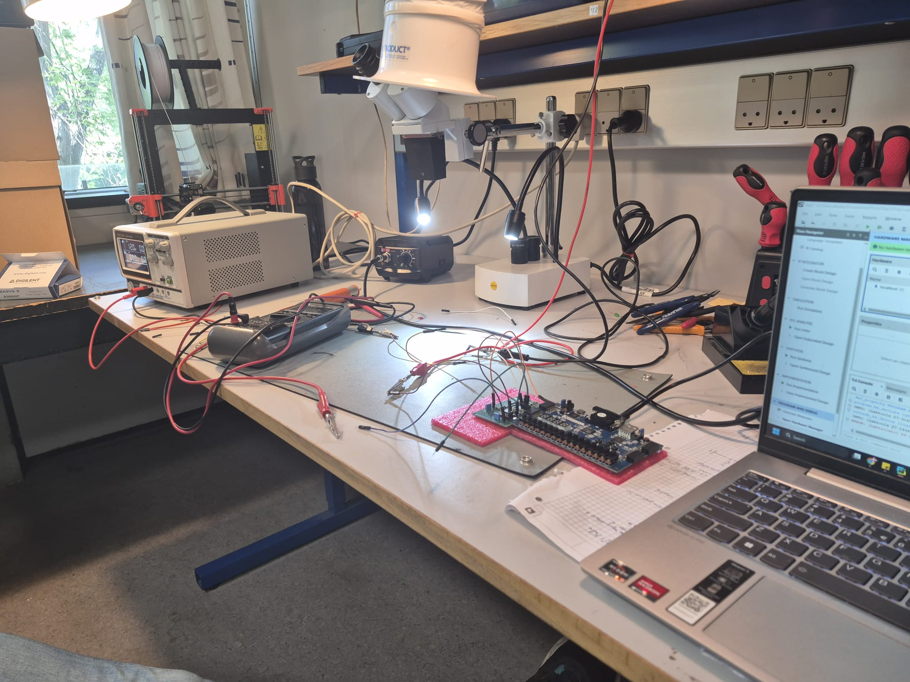

# Read me

# Quickstart

To transpile to Verilog run ```sbt run```

To run the test suite, run ```sbt test```

To run individual test suites, run ```sbt "TestOnly controller.xxx_tb"```, for example ```sbt "TestOnly controller.PWM_tb"```

# Introduction
This was built for the DTU course 22400 : Design build 4. 
This is the final practical 3 week course for Bsc. General Engineering students at DTU, where large, interdisciplinary groups of 10 students must make an autonomous system to keep mussels alive. 
There was a lot of freedom to decide what problems to deep dive into, hence we decided to focus on improving the ADC of the ESP32 provided.

The ESP32 is a great, cheap microcontroller. 
It does however suffer from a non-linear ADC, with potentially 60 mV of DC offset.
Even if you linearize it with the built in DAC, you are building on a broken foundation.
Hence we decided to build a custom 8-bit ADC which is controller by a FPGA. 
It will compute PID effort values and the temperature, and send those to a ESP for monitoring. 
The FPGA also outputs a PWM signal, which can drive the relay directly.
Alternatively, you can use the effort values sent over SPI and use those on another microcontroller.

# Overall system / Context
The course expects a cooler to cool the system to a desired temperature. 
That cooler is connected via a relay, with some kind of controller deciding whether to cool depending on the voltage running through a thermister.
That is where this project comes in, it digitizes the thermister voltage, and then generates both a PID effort value and a PWM signal.
That allows some flexibility in which device (either the ESP32 or the FPGA) to switch the relay. 
The temperature, combined with the individual P,I and D effort values and the combined PID effort are sent to the MCU via SPI (160 bit frames, or 20 bytes), and this information is sent to a grafana dashboard for visualisation.

A resistor was put in series with the thermister, which we optimised to give the best thermal resolution possible (read the SystemAnalysis folder).

# Part list

| Name                    |
|:------------------------|
| 6.8 k$\Omega$ resistors |
| CA3140E Op-Amps         |
| LM393N Comparator       |
| Perfboards              |
| Jumper wires            |
| Basys 3 FPGA            |

# Testing Procedure


We first built the DAC and tested it.
When we were happy with the result (solid linearity and limited error), we installed the comparator and voltage followers. 
We then documented the performance (ADC code) for every 100 mV (supplied via a power supply with +/- 5mV error).
After we validate that performance, we moved to system integration with our group members.

We also tested our PID simulation script (read the PIDAnalysis folder). 
It performed well, but it did behave differently than expected. 
It could be because the volume of water was different than in our simulation, or that the time before the cold water reaches the sensor was different than expected.
In either case, the initial test was used to adjust the P,I,D values for a more stable controller.

# Results


The ADC tests well (see README in the ADCDesign folder) and is extremely convenient to use as it can plug directly into the FPGA. It has 2.5mV of error, near 0mV offset, and is highly linear. 
It does however struggle heavily when the relay is connected and starts switching, significantly getting more noise than during testing.
We were unable to fix the relay noise during the course, but a further revision could make the project viable.

# Post Mortem
If we were to do the project again, we would isolate the digital signals from the analogue ones much more. 
The entire system is running off the same power supply, which is great for the overall system design, but bad for the sensitive ADC components.
Additionally, the power supply was struggling to supply 12V, sagging to 8.3V. 
We should get more powerful power supplies, and seperate the power supplied to the analogue and digital sections.
Additionally, should also use more voltage regulator ICs to stabilize the voltage on the ADC.

# Group / Responsibilities
Örn Arnarson: https://www.linkedin.com/in/%C3%B6rn-arnarson-b6bb141b5/ : ADC Soldering, design and testing

Mark van Damme: FPGA programming, ADC Design, soldering and testing

Aidan Fiil-Flynm: ADC testing

# Further Reading

Look into the "ADCDesign" folder for more graphs and the perfboard iterations we did.

Look into the "PIDAnalysis" folder on how our PID simulation was derived and performed.

Look into the "SystemAnalysis" folder on how we selected the resistor value for the setting resistor.

Look into the "src\main\scala\controller" folder to see an overview of the FPGA firmware and resource utilisation.

Look into schematic.pdf to the the FPGA routing of the firmware.