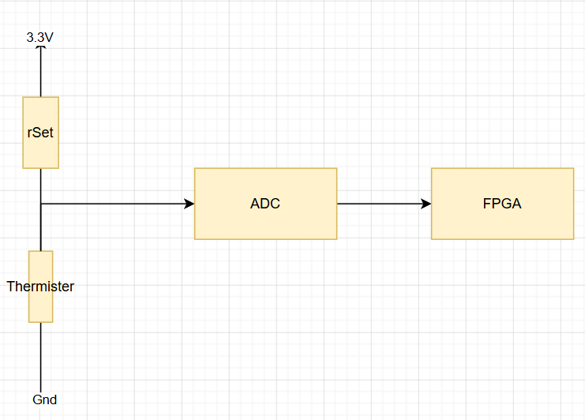

## rSet resistor derivation

The thermister is in series with a setting resistor, which we need to derive the optimal resistor value for.
Optimal here means that it offers the best thermister resolution for the temperature range we care about. 
Above 25 degrees it doesn't matter (just maximize the cooling to cool it down), and we still need accurate data down to 0 degrees (to send the temperature to the ESP to let it avoid the peltier cooler freezing the pump).
Hence we optimized between 0 and 25 degrees.

That gave us a resistance of 16.6 k$\Omega$, which offers a resolution of 0.4 degrees celcius for a 8 bit ADC.