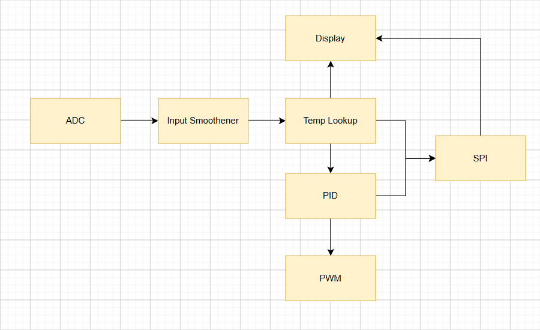

# FPGA Overview

## Block Diagram

This is an extremely high level overview of the project.

Firstly the ADC module utilizes the SAR algorithm to digitize the incoming analogue signal.
Then the digital representation gets smoothened by averaging the incoming signal. 
This is done by passing the values to a sliding window accumulator and right shifting the output (since the error period is a power of 2, this is much more effective than a standard division).
Then this value gets passed to a precomputed lookup table, which gets converted to a Q8,24F fixed point number.
Then the error is passed along to the PID controller, where the P,I and D effort, along with the total effort, is calculated and passed along to both the SPI and PWM outputs.
The PWM module then generates a PWM signal based on the PID effort.
The SPI module also passes an enable flag to the Display modules (which controls whether a PWM signal needs to be generated, not shown in diagram).

## Module Functionality

| Module Name       | Function                                                                                                                                           | 
|-------------------|----------------------------------------------------------------------------------------------------------------------------------------------------|
| Accumulator       | A standard sliding window accumulator for unsigned values                                                                                          |
| ADC               | Implements the SAR Algorithm and controlls the DAC output pins                                                                                     |
| Clamp             | A clamp for signed integers                                                                                                                        |
| Controller        | Top level module for the overal project                                                                                                            |
| Display           | Handles the state machine for the current display state, and outputs the values shown on the sseg                                                  |
| PID               | Performs P,I,D and PID effort calculations                                                                                                         |
| PWM               | Generates PWM signals                                                                                                                              |
| SAccumulator      | A standard sliding window accumulator for signed values                                                                                            |
| SPI               | Transmits P,I,D and PID effort values along with temperature (all Q8,24F) and receives the set point and if it should generate a PWM signal via SPI |
| SSegDecoder       | Converts numbers and ASCII characters to the relevant sseg values                                                                                  |
| TemperatureLookup | A lookup table to convert ADC values to Q8,24F temperature values                                                                                  |